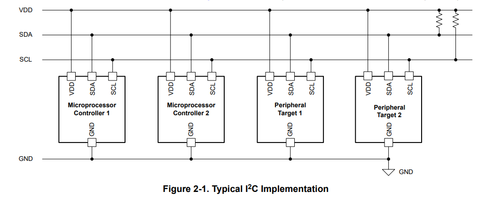
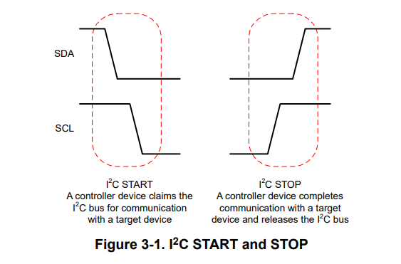
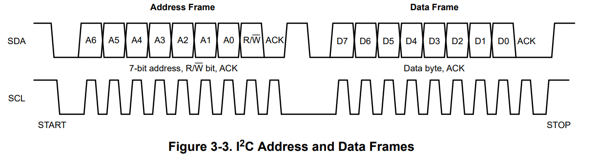

# Summary of I2C Communication Protocol

## Overview  
I²C (Inter-Integrated Circuit) is a two-wire serial communication protocol using a Serial Data Line (SDA) and a Serial Clock Line (SCL). It supports multiple target devices and controllers on a communication bus. I²C has various speed modes, including:

1. **Standard-mode (Sm)**: Up to 100 kbps.
2. **Fast-mode (Fm)**: Up to 400 kbps, contingent on bus capacitance and drive capability.
3. **Fast-mode Plus (Fm+)**: Up to 1 Mbps, requiring stronger drivers for faster rise and fall times.
4. **High-speed mode (Hs-mode)**: Up to 3.4 Mbps, requiring a controller code to activate this mode.
5. **Ultra-Fast mode (UFm)**: The fastest, transferring data up to 5 Mbps but is write-only and omits some I²C features.

## Communication Structure  
I²C employs two lines (SDA and SCL) for bidirectional, half-duplex communication. It allows multiple controllers and devices on a single bus, needing pull-up resistors on both lines.

- **SCL (Serial Clock)**: Controlled by the controller to time data transmission.
- **SDA (Serial Data)**: Used for data transmission to/from target devices.

 <!-- Replace this link with an actual image link if available -->

I²C communication is initiated by a **START condition**, where the controller pulls SDA low followed by SCL. A **STOP condition** signals the end of communication, allowing other devices to use the bus.

 <!-- Replace this link with an actual image link if available -->

## Logical Data Representation  
Data is sent as a sequence of bits, where:
- A logical **1** is represented by SDA being released (pulled high by a pull-up resistor).
- A logical **0** occurs when SDA is pulled low.

Data changes should not occur between SCL's rising and falling edges to maintain valid bit transmission.

## Communication Frames  
I²C communication consists of frames, starting with an address frame followed by data frames. Each frame includes an acknowledge (ACK) bit to confirm successful communication.

 <!-- Replace this link with an actual image link if available -->

1. **Address Frame**: Initiated with a START condition, this frame includes:
   - A **7-bit device address**: Each device on the I²C bus has a unique address.
   - An **R/W bit**: Indicates whether the controller intends to read (1) or write (0) data.

   - **ACK in Address Frame**: 
     - After the address is sent, the addressed **target device** acknowledges by pulling the SDA line low during the next SCL clock pulse. This signals to the controller that it has successfully received the address.

2. **Data Frame**: Consists of one byte of data followed by an ACK. The behavior of the ACK bit depends on whether the operation is a read or a write:
   - **Write Operation**: 
     - The controller sends a data byte to the target device.
     - After the data byte is sent, the **target device** acknowledges by pulling the SDA line low during the next SCL pulse. This indicates that the data has been successfully received.
   
   - **Read Operation**: 
     - The controller requests data from the target device.
     - After the target device sends the data byte, the **controller** acknowledges by pulling the SDA line low during the next SCL pulse. This indicates that it has successfully received the data. If the controller does not pull SDA low, it signals a NACK, indicating no more data will be read.

## Acknowledge (ACK) Bit Summary  
- **Address Frame**: **Target Device** acknowledges by pulling SDA low.
- **Data Frame**:
  - **Write Operation**: **Target Device** acknowledges by pulling SDA low.
  - **Read Operation**: **Controller** acknowledges by pulling SDA low.

The communication ends with a **STOP condition**. ACK/NACK bits are crucial for verifying successful transmission and can indicate issues with device addressing or data reception.

This summary encapsulates the essentials of I²C communication, including its operational modes, communication structure, data representation, frame organization, and the specific mechanics of the acknowledge bit during address and data transmissions.
