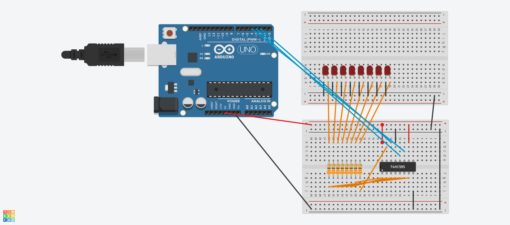

# 74HC595 Shift Register

## Overview

The **74HC595** is an 8-bit serial-in, parallel-out shift register with a storage register and an output latch. It allows you to control multiple output pins using only a few microcontroller pins, making it a popular choice for driving LEDs, controlling displays, and more in embedded systems.

### Key Features:
- 8-bit shift register
- Serial data input
- Parallel output
- Built-in storage register (latch)
- Cascadable for expanding the number of outputs

## How It Works

The **74HC595** consists of two main sections:
1. **Serial Shift Register**: This section receives the input data serially (one bit at a time) and shifts it through the register.
2. **Latch/Output Register**: Once the data is shifted into the register, it can be latched to the output pins. This allows the outputs to hold their value until new data is provided, which is particularly useful in applications where you want to maintain the output state without continuously sending data.

### Pin Configuration

The **74HC595** has the following key pins:
- **DS (Data Serial Input)**: The pin where the serial data is fed into the shift register.
- **SH_CP (Shift Clock Pin)**: Each pulse on this pin shifts the data from the shift register to the output register.
- **ST_CP (Storage Clock Pin)**: This pin latches the data present in the shift register into the output pins.
- **Q0 - Q7**: The output pins that provide the parallel output of the data.
- **MR (Master Reset)**: Active low pin that resets the register.
- **OE (Output Enable)**: Active low pin that enables the output. When high, the outputs are in a high-impedance state.
- **Vcc and GND**: Power supply pins.

### Connection Diagram

 <!-- Replace this link with an actual image link if available -->

## Circuit Connection Example

When connecting the **74HC595** to an Arduino, you typically use three pins:
- **Data Pin (DS)**: Connects to a digital pin on the Arduino for sending data.
- **Clock Pin (SH_CP)**: Connects to another digital pin to control when to shift the bits.
- **Latch Pin (ST_CP)**: Connects to a third digital pin to control when to latch the data to the output.

## Using `shiftOut()`

The `shiftOut()` function in Arduino is a built-in method used to send data to shift registers like the **74HC595**. It allows you to control the data output through a specified pin while shifting the bits in either the most significant bit (MSB) or least significant bit (LSB) order.

### Parameters of `shiftOut()`

The `shiftOut()` function takes four parameters:

1. **dataPin**: 
   - Type: `int`
   - Description: This parameter specifies the pin number connected to the **DS** (Data Serial Input) of the shift register. It is the pin through which the data will be sent serially.

2. **clockPin**: 
   - Type: `int`
   - Description: This parameter specifies the pin number connected to the **SH_CP** (Shift Clock Pin). Each pulse on this pin causes the shift register to shift the data by one bit, moving the bit in the DS pin to the next stage of the register.

3. **bitOrder**: 
   - Type: `int`
   - Description: This parameter determines the order in which the bits are sent to the shift register. You can choose either:
     - `MSBFIRST`: Sends the most significant bit (bit 7) first.
     - `LSBFIRST`: Sends the least significant bit (bit 0) first.

4. **value**: 
   - Type: `byte` (or `uint8_t`)
   - Description: This parameter contains the byte of data to be sent to the shift register. It represents the values to be shifted out, where each bit corresponds to an output pin (Q0 to Q7).

### Functionality

When `shiftOut()` is called, it serially sends the bits specified in the **value** parameter to the **74HC595** shift register via the **dataPin**. Each pulse on the **clockPin** moves the bits into the shift register, and once all bits are sent, the data can be latched to the output pins using the **ST_CP** pin.

## Conclusion

The **74HC595** shift register is a versatile component for expanding the number of outputs in embedded systems. By utilizing the `shiftOut()` function in Arduino, you can effectively control multiple outputs with just a few pins, enabling you to create complex and interactive projects.

For further reading, please refer to the [74HC595 datasheet](https://www.ti.com/lit/ds/symlink/74hc595.pdf).

