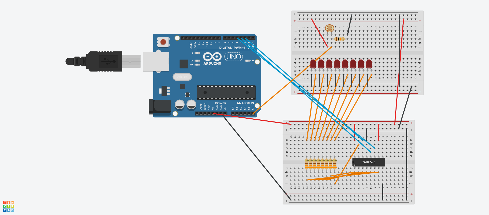
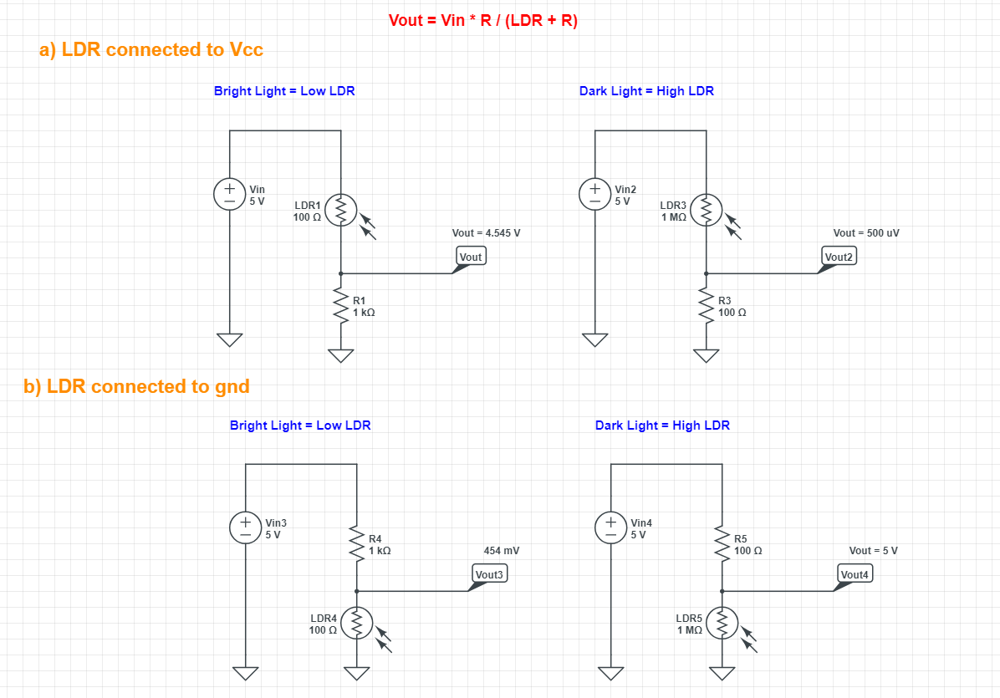

# Photo Resistors (LDRs)

 <!-- Replace this link with an actual image link if available -->

## How Photo Resistors Work
Photo resistors, or Light Dependent Resistors (LDRs), are semiconductor devices that exhibit a change in resistance based on the intensity of incident light. The underlying principle of how LDRs function relates to the photoelectric effect, which describes how light energy can excite electrons in a material:

- **Material Composition**: LDRs are commonly made from cadmium sulfide (CdS) or similar materials that exhibit photoconductivity. In the absence of light, the material's electrons are in a bound state, resulting in high resistance.

- **Effect of Light**: When light photons strike the LDR, they impart energy to the electrons, allowing them to move from their bound states to free states. This process reduces the overall resistance of the material because more charge carriers (free electrons) are available to conduct current. In simple terms, as light intensity increases, the resistance decreases significantly, enabling more current to flow.

- **Resistance Range**: Typically, the resistance of LDRs ranges from **1 kΩ** in bright light to about **100 kΩ** or more in darkness. This wide range allows LDRs to be sensitive to varying light conditions.

## Typical Ranges
LDRs are characterized by their resistance changes based on light intensity. The following ranges are typical:
- **Bright Light**: Approximately **1 kΩ** to **5 kΩ**
- **Moderate Light**: Approximately **10 kΩ** to **20 kΩ**
- **Darkness**: Ranges from **100 kΩ** to **1 MΩ** or higher

## Using LDRs as a Voltage Divider
LDRs can be effectively utilized in a voltage divider circuit. The basic setup involves connecting the LDR in series with a fixed resistor. The output voltage from this divider can be read by an analog input on an Arduino or similar microcontroller:

\[
V_{out} = V_{in} 	imes rac{R_{fixed}}{R_{LDR} + R_{fixed}}
\]

Where:
- \( V_{in} \) is the input voltage (e.g., 5V).
- \( R_{fixed} \) is the resistance of the fixed resistor.
- \( R_{LDR} \) is the resistance of the LDR.

This configuration allows you to measure changes in light intensity as changes in voltage.

## Connection Configurations
- **LDR Connected to Vcc**: When the LDR is connected to the positive voltage (Vcc) and the fixed resistor to ground, the output voltage is higher in bright light and lower in darkness. This setup is beneficial if you want the analog signal to increase with light intensity.
  
- **LDR Connected to Ground**: In this configuration, with the LDR connected to ground and the fixed resistor connected to Vcc, the voltage output will behave inversely—lower in bright light and higher in darkness. This arrangement is suitable for applications requiring the signal to drop as light increases.

 <!-- Replace this link with an actual image link if available -->

## Limitations in Mapping Values
Using a single fixed resistor to achieve a complete mapping from **0 to 1023** on the Arduino is challenging due to the nonlinear response of the LDR. The main issues include:

1. **Nonlinear Behavior**: The resistance of the LDR changes nonlinearly with light intensity, complicating the mapping of analog values.
  
2. **Fixed Resistor Limitations**: Depending on the value of the fixed resistor, the output may only provide useful readings in either bright or dark conditions, but not both. For example, a **10kΩ** resistor might work well in bright light but yield poor results in darkness.

## Solutions to Overcome Mapping Limitations
To improve the mapping of analog values across both light and dark conditions, consider the following strategies:

1. **Use of the `map()` Function**: This function in Arduino can scale the raw readings based on the observed minimum and maximum values.

2. **Smoothing Algorithms**: Implement a moving average filter to reduce noise and improve reading stability.

3. **Dual Resistor Configurations**: Use variable resistors (potentiometers) or multiple fixed resistors to adjust the resistance based on conditions dynamically.

4. **Operational Amplifiers**: Use op-amps to amplify the output signal, enhancing sensitivity across varying light conditions.

5. **Software Calibration**: Collect raw data under known lighting conditions to determine effective min and max values, then adjust readings in software accordingly.

## Conclusion
By understanding how LDRs operate, their resistance ranges, and their role in voltage dividers, you can effectively integrate them into projects that respond to light. Awareness of their limitations and available solutions will help ensure accurate and meaningful data from your light sensors.

## Further Reading
- [How Light Dependent Resistors Work](https://learn.sparkfun.com/tutorials/light-dependent-resistor-ldr)
- [Voltage Divider Basics](https://www.electronics-tutorials.ws/waveforms/voltage-divider.html)
- [Arduino Analog Input Documentation](https://www.arduino.cc/en/Tutorial/BuiltInExamples/AnalogReadSerial)

